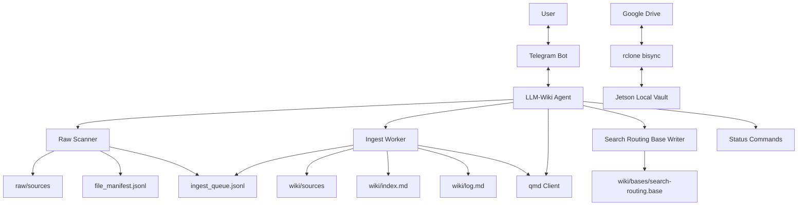
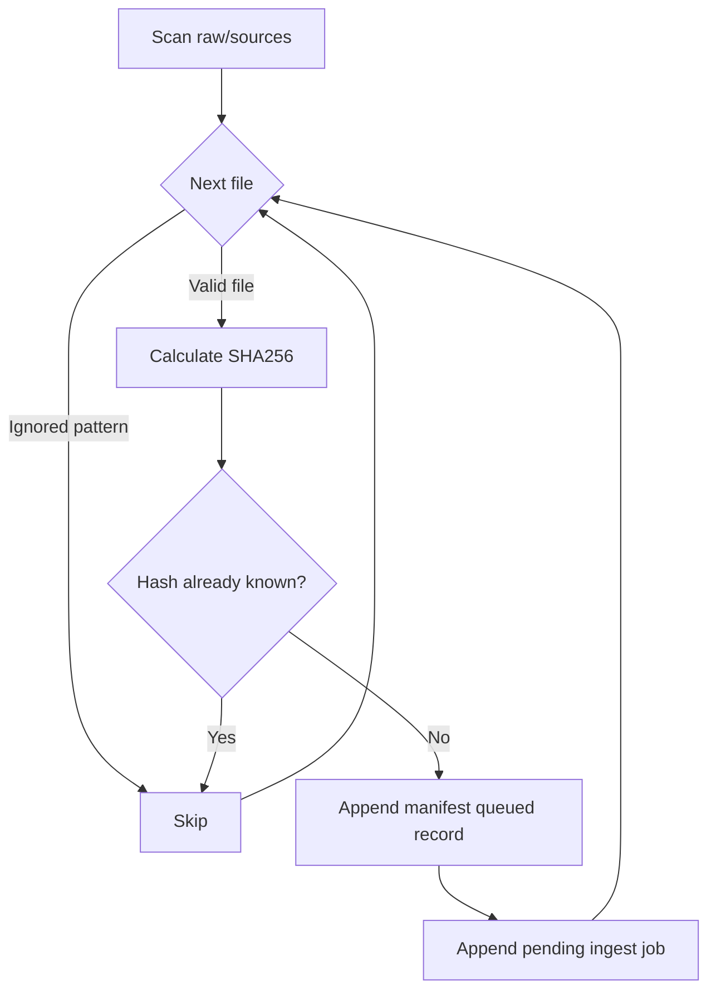
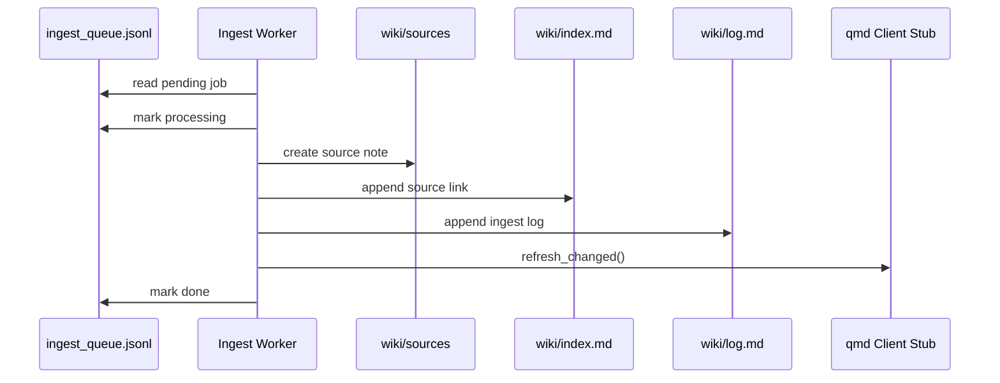
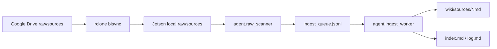
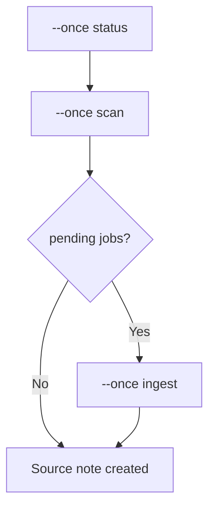

# LLM-Wiki Agent 개발 문서

이 문서는 현재 MVP 구현을 기준으로 개발 방향, 기능 구성, 주요 기능 흐름을 설명한다.
상세 장기 로드맵은 `plan/initial_plan.md`에 있으며, 이 문서는 실제 코드 구조와 운영 흐름을 빠르게 이해하기 위한 기준 문서다.

## 개발 방향

LLM-Wiki Agent는 Jetson을 상시 실행 노드로 사용해 Google Drive와 동기화되는 Obsidian Wiki Vault를 관리한다. Google Drive는 직접 작업 공간이 아니라 동기화 및 백업 계층이며, Agent는 Jetson 로컬 Vault를 수정한다.

현재 구현은 Phase 1-4 MVP에 집중한다.

- Docker 기반 Python 3.12 실행 환경을 기본 런타임으로 사용한다.
- `raw/sources/`에 들어온 파일을 SHA256 기준으로 감지한다.
- 감지된 파일은 JSONL manifest와 ingest queue에 기록한다.
- ingest worker가 pending job을 처리해 `wiki/sources/`에 source note를 만든다.
- `wiki/index.md`와 `wiki/log.md`를 갱신한다.
- Telegram 명령은 `/status`, `/scan`, `/queue`, `/ingest`, `/local`, `/global`, `/search`, `/route`를 제공한다.
- qmd는 CLI 명령 템플릿을 설정하면 실제 명령을 호출하고, 사용할 수 없으면 Wiki Markdown fallback 검색을 수행한다.
- Obsidian Bases용 `wiki/bases/search-routing.base`를 생성해 Local/Global/Hybrid 후보 view를 제공한다.

장기 방향은 다음 순서로 확장한다.

1. raw scanner와 ingest worker 안정화
2. qmd local/global 검색 연동
3. Obsidian Bases metadata 기반 search routing
4. Telegram 질의응답과 source provenance 답변
5. patch-first 기반 Wiki 업데이트 승인 흐름

## 시스템 구성



Agent의 데이터 경로는 환경변수로 제어한다.

| 환경변수 | 기본 Docker 값 | 역할 |
|---|---|---|
| `WIKI_ROOT` | `/data/vault` | Obsidian Vault root |
| `AGENT_STATE_DIR` | `/data/agent-state` | queue, manifest, logs, locks |
| `CONFIG_DIR` | `/data/config` | qmd/rclone/rules 설정 |
| `QMD_CONFIG` | `/data/config/qmd.yaml` | qmd 설정 파일 경로 |

## 주요 기능

### Raw Scanner

`agent.raw_scanner`는 `raw/sources/` 아래 파일만 자동 ingest 대상으로 본다.

- 임시 파일과 숨김 파일은 제외한다.
- 파일명 대신 SHA256 hash로 중복을 판단한다.
- 새 파일은 `file_manifest.jsonl`에 `queued` 상태로 기록한다.
- 새 파일은 `ingest_queue.jsonl`에 pending job으로 등록한다.



### Ingest Worker

`agent.ingest_worker`는 pending job을 처리해 Wiki source note를 만든다.

- job 상태를 `processing`으로 바꾼다.
- raw file을 읽고 `wiki/sources/{safe-stem}.md`를 생성한다.
- 텍스트/Markdown 파일은 내용을 source note에 포함한다.
- PPTX는 `vendor/doc-xml-parser` submodule의 parser가 있으면 우선 사용해 읽기 순서, 표, 이미지, caption 관계를 반영한 Markdown으로 변환한다.
- PDF/DOCX/XLSX/이미지는 사용 가능한 추출기 또는 내장 parser로 텍스트를 추출한다.
- `wiki/index.md`와 `wiki/log.md`를 갱신한다.
- manifest와 queue 상태를 `ingested`/`done`으로 바꾼다.
- qmd refresh를 호출한다. qmd CLI가 없으면 안전하게 fallback 처리한다.



### Telegram Commands

`agent.telegram_bot`는 polling 기반 명령 처리 표면을 제공한다.

| 명령 | 동작 |
|---|---|
| `/status` | Vault 경로, manifest 개수, queue 상태를 반환 |
| `/scan` | raw scanner를 1회 실행 |
| `/queue` | queue 상태별 job 개수를 반환 |
| `/ingest` | pending ingest job을 처리 |
| `/bases` | `wiki/bases/search-routing.base`를 생성 |
| `/local <query>` | local fallback/qmd 검색 |
| `/global <query>` | global fallback/qmd 검색 |
| `/route <query>` | local/global 후보와 추천 anchor 반환 |

Telegram document upload는 파일을 `raw/sources/`에 저장하고 `telegram_upload` source로 ingest queue에 즉시 등록한다. 같은 파일명이 이미 있으면 raw 원본을 덮어쓰지 않고 `name-2.ext` 형식으로 저장한다.

허용 사용자가 설정되어 있으면 `TELEGRAM_ALLOWED_USER_IDS`에 포함된 사용자만 명령을 실행할 수 있다.

### qmd Client

`agent.qmd_client`는 qmd CLI 연동과 fallback Markdown 검색을 제공한다.

- `refresh_changed(settings)`는 `QMD_REFRESH_COMMAND` 또는 기본 `qmd refresh --config ...`를 실행한다.
- `search(settings, query, mode)`는 `QMD_SEARCH_COMMAND` 또는 기본 `qmd search ...`를 실행한다.
- qmd 명령이 없거나 실패하면 `wiki/**/*.md`를 대상으로 fallback 검색을 수행한다.
- ingest worker는 source note 생성 후 qmd refresh를 요청한다.

## 주요 실행 흐름

### Drive Sync 이후 자동 인제스트



### CLI Smoke Flow

로컬 또는 컨테이너에서 다음 순서로 MVP 흐름을 검증한다.

```bash
python -m agent.main --once status
python -m agent.main --once scan
python -m agent.main --once ingest
```



## 운영 원칙

- `raw/` 원본은 수정, 삭제, 덮어쓰기하지 않는다.
- source note, index, log는 Agent가 생성하거나 append한다.
- 기존 topic/entity 문서의 대규모 수정은 후속 Phase에서 patch-first 승인 방식으로 구현한다.
- Google Drive와 Agent의 책임을 분리한다. Drive는 동기화 계층이고, Agent의 실제 작업 대상은 로컬 Vault다.
- qmd/Bases metadata는 답변 근거가 아니라 검색 라우팅 근거로 사용한다.

## 향후 문서화 대상

후속 Phase가 구현되면 다음 문서를 추가한다.

- `docs/search-routing.md`: qmd local/global 검색과 Bases metadata 결합
- `docs/telegram-ops.md`: Telegram 운영 명령과 알림 정책
- `docs/update-policy.md`: patch-first Wiki 업데이트 승인 흐름
- `docs/deployment.md`: Jetson systemd, rclone, Docker 운영 절차
